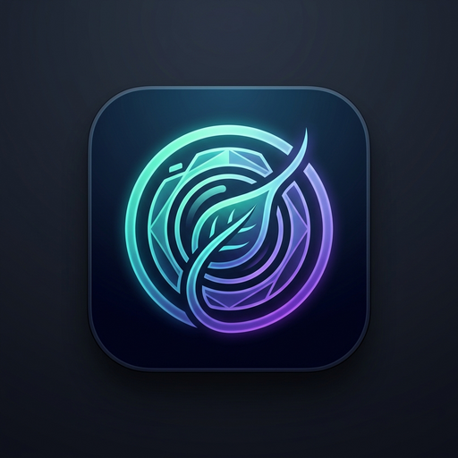

<div align="center">

  

  # NutriVision

  **Autonomous Multimodal AI Nutrition Intelligence & 3D Anatomical Workout Engine**

  [](https://nextjs.org/)
  [](https://react.dev/)
  [](https://www.typescriptlang.org/)
  [](https://www.convex.dev/)
  [](https://clerk.com/)
  [](https://groq.com/)
  [](https://tailwindcss.com/)
  [](https://vercel.com/)

  [Explore Live Demo](https://nutrivision-hazel.vercel.app) • [Report Bug](https://github.com/dariuss09/NutiVision/issues) • [Request Feature](https://github.com/dariuss09/NutiVision/issues)

</div>

---

## 🌟 Overview

**NutriVision** is a production-grade, full-stack fitness and nutritional intelligence platform built with **Next.js 16**, **React 19**, **Convex**, and **Clerk**. It bridges the gap between dietary tracking and physical conditioning by pairing multimodal AI food vision analysis with an interactive, gamified 3D anatomical body map.

Designed as an end-to-end modern web application, NutriVision provides instant, sub-second photo meal recognition, micronutrient and glycemic indexing, intelligent manual recipe calculation from nutrition labels, and a comprehensive strength mastery ranking system based on exercise-specific 1RM targets.

---

## 🚀 Key Features

### 📸 Multimodal AI Vision Food Scanner
- **Instant Photo Recognition**: Upload or snap a meal picture to receive an immediate breakdown of food items, calculated portion weights, calories, and macronutrients (protein, carbohydrates, healthy fats, fiber, and net carbs).
- **Clinical Micronutrient Profiling**: Estimates sodium, potassium, calcium, iron, and key vitamins alongside an automated glycemic index rating (Low, Medium, High).
- **Dietary Tags & Health Score**: Classifies meals with health scores (1–100), allergen alerts, health watchouts, and actionable advice from an AI dietitian.
- **Strict JSON Output Enforcement**: Utilizes zero-shot structured JSON inference via Groq LPU acceleration and vision LLMs for high reliability and speed.

### ⚖️ Precision Manual Recipe & Label Builder
- **Custom Ingredient Formulation**: Add individual ingredients with exact gram weights and save entire custom recipes as reusable presets.
- **Package Label Mode (Per 100g)**: Directly enter nutritional facts from food packages (Kcal, Protein, Carbs, Fats per 100g) — NutriVision automatically computes the exact proportional macros for any custom portion size.

### 🏋️ Interactive 3D Anatomical Workout Tracker
- **Visual Muscle Highlighter**: Powered by `react-body-highlighter`, highlighting targeted anterior and posterior muscle groups (Chest, Back, Shoulders, Biceps, Triceps, Quads, Hamstrings, Glutes, Calves, and Core).
- **Gamified 9-Tier Strength Ranks**: Automatically evaluates lifts across 9 tiers from **Wood** to **Olympian** using exercise-specific standards (e.g., Squat, Bench Press, Lateral Raises, Overhead Press, Rows).
- **Deep-Dive Muscle Inspector**: Interactive modal overlay on the anatomical body map revealing your current rank, mastery progress, and personal record per muscle group.
- **Lift Volume Analytics**: Tracks cumulative tonnage and total volume progression across sessions.

### 💧 Hydration & Wellness Streak Tracker
- Quick-tap water logging (250ml, 500ml increments) with dynamic visual progress meters.
- Hydration goal milestones and streak tracking.

### ⚡ Real-Time Reactive Architecture
- **Zero-Latency State Sync**: Powered by **Convex**, synchronizing intake, workouts, and goals instantaneously across desktop, tablet, and mobile devices without manual page refreshes.
- **Cross-Device Continuity**: Seamless session persistence and real-time document listeners.

### 🤖 Telegram Bot Reminders & Cron Jobs
- Integrated serverless cron tasks and Telegram bot integration for scheduled meal check-ins, hydration nudges, and daily workout streak notifications.

### 🔐 Zero-Trust Security & Multi-Tenant Authentication
- Authenticated via **Clerk** with server-side middleware route guarding and Google OAuth integration.
- Strict database row-level security ensuring all user data is private and isolated.

---

## 🛠️ Architecture & Tech Stack

| Layer | Technologies |
| :--- | :--- |
| **Frontend Framework** | [Next.js 16](https://nextjs.org/) (App Router), [React 19](https://react.dev/) |
| **Language** | [TypeScript 6.0](https://www.typescriptlang.org/) |
| **State & Cloud Database**| [Convex](https://www.convex.dev/) (Reactive Serverless Cloud Backend) |
| **Authentication** | [Clerk Auth](https://clerk.com/) (JWT Sessions, Middleware Protection, Google SSO) |
| **AI & Vision Engine** | [Groq SDK](https://groq.com/) (LPU Accelerated Multimodal Vision LLMs) |
| **Styling & UI** | [Tailwind CSS v4](https://tailwindcss.com/), [Lucide React](https://lucide.dev/), [Tw-Animate-CSS](https://github.com/) |
| **Visualizations & 3D** | [Recharts](https://recharts.org/), [React Body Highlighter](https://github.com/) |
| **Deployment & Hosting**| [Vercel](https://vercel.com/) |

---

## 🔒 Security & Secrets Management

NutriVision was architected from day one to be safe for open-source and public repositories:

1. **Zero Client-Side Secret Leaks**:
   - Sensitive credentials (`GROQ_API_KEY`, `CLERK_SECRET_KEY`, `TELEGRAM_BOT_TOKEN`) run strictly inside Next.js server-side API routes (`/api/nutrition/analyze`, `/api/telegram`) and Convex serverless functions.
   - They are **never** bundled or transmitted to the client browser.
2. **Environment Variable Isolation**:
   - All live secrets reside in `.env.local` (local development) or encrypted within the Vercel Production Environment Dashboard.
   - All `.env*` files and deployment credential dumps (`vercel-env.txt`) are excluded in `.gitignore` and never committed to version control.
3. **Public Client Identifiers**:
   - Variables prefixed with `NEXT_PUBLIC_` (`NEXT_PUBLIC_CLERK_PUBLISHABLE_KEY`, `NEXT_PUBLIC_CONVEX_URL`) are public frontend connection identifiers designed by Clerk and Convex for client handshakes, adhering to OAuth 2.0 / PKCE security standards.

---

## 📁 Project Directory Structure

```text
my-app/
├── app/
│   ├── api/
│   │   ├── nutrition/analyze/    # Server-side Groq Vision AI analysis endpoint
│   │   └── telegram/             # Telegram bot webhook handler
│   ├── dashboard/                # Main authenticated dashboard page
│   ├── globals.css               # Tailwind CSS v4 design tokens & theme
│   ├── layout.tsx                # Root layout with Clerk & Convex providers
│   └── page.tsx                  # Landing page & authentication gateway
├── components/
│   ├── ConvexClientProvider.tsx  # Clerk + Convex authentication bridge
│   ├── GoalSettingsModal.tsx     # Calorie & macro goal customization modal
│   ├── Header.tsx                # Responsive navigation & brand logo
│   ├── HistoryTracker.tsx        # Daily logs, timeline, and macro analytics
│   ├── ManualRecipeBuilder.tsx   # Per-100g label builder & recipe preset manager
│   ├── NotificationCenterModal.tsx # Alert center & notification management
│   ├── NutritionDetailsCard.tsx  # Nutritional breakdown & AI feedback view
│   ├── VisionScanner.tsx         # Camera/photo upload & AI processing UI
│   ├── WaterTracker.tsx          # Real-time hydration logging & streak UI
│   └── WorkoutTracker.tsx        # 3D anatomical muscle map & 9-tier ranking system
├── convex/
│   ├── auth.config.ts            # Clerk JWT validation config
│   ├── crons.ts                  # Scheduled background cron triggers
│   ├── food.ts                   # Food log mutations and reactive queries
│   ├── goals.ts                  # User goal settings storage
│   ├── schema.ts                 # Strongly-typed database schema definitions
│   ├── telegram.ts               # Telegram notification workers
│   └── workouts.ts               # Workout logs, 1RM data, and history queries
├── public/                       # Static brand assets, manifest, and icons
├── .env.example                  # Safe environment variable template
├── middleware.ts                 # Clerk route-guarding middleware
├── next.config.mjs               # Next.js runtime configuration
└── package.json                  # Dependencies & scripts
```

---

## 💻 Getting Started

Follow these steps to run NutriVision locally on your machine.

### Prerequisites

- [Node.js](https://nodejs.org/) (v18.18.0 or newer recommended)
- [npm](https://www.npmjs.com/) or [pnpm](https://pnpm.io/)
- A free [Convex account](https://convex.dev/)
- A free [Clerk account](https://clerk.com/)
- A free [Groq Cloud account](https://console.groq.com/)

### 1. Clone the Repository

```bash
git clone https://github.com/your-username/NutriVision.git
cd NutriVision/my-app
```

### 2. Install Dependencies

```bash
npm install
```

### 3. Configure Environment Variables

Create your local `.env.local` file from the provided example template:

```bash
cp .env.example .env.local
```

Open `.env.local` and add your API keys:

| Variable | Description | Where to Obtain |
| :--- | :--- | :--- |
| `CONVEX_DEPLOYMENT` | Convex project deployment identifier | [Convex Dashboard](https://dashboard.convex.dev/) |
| `NEXT_PUBLIC_CONVEX_URL` | Public URL for Convex reactive sync | [Convex Dashboard](https://dashboard.convex.dev/) |
| `NEXT_PUBLIC_CONVEX_SITE_URL` | Site URL for Convex HTTP endpoints | [Convex Dashboard](https://dashboard.convex.dev/) |
| `NEXT_PUBLIC_CLERK_PUBLISHABLE_KEY` | Clerk public frontend key | [Clerk Dashboard](https://dashboard.clerk.com/) |
| `CLERK_SECRET_KEY` | Clerk backend secret key | [Clerk Dashboard](https://dashboard.clerk.com/) |
| `CLERK_JWT_ISSUER_DOMAIN` | Clerk JWT issuer domain for Convex auth | [Clerk Dashboard](https://dashboard.clerk.com/) |
| `GROQ_API_KEY` | API key for high-speed AI vision inference | [Groq Console](https://console.groq.com/) |
| `TELEGRAM_BOT_TOKEN` *(Optional)* | Telegram Bot token for daily notifications | [@BotFather](https://t.me/botfather) |
| `TELEGRAM_CHAT_ID` *(Optional)* | Telegram Chat ID for alerts | Telegram client |

### 4. Initialize Convex

In a separate terminal window, initialize your Convex backend:

```bash
npx convex dev
```

### 5. Start the Development Server

```bash
npm run dev
```

Open [http://localhost:3000](http://localhost:3000) in your browser to view the application.

---

## 🚀 Deployment

The easiest way to deploy NutriVision is using [Vercel](https://vercel.com/):

1. Push your repository to GitHub.
2. Import the project into Vercel.
3. Configure the **Root Directory** as `my-app` (or your repository root).
4. In the Vercel Project Settings, add all variables defined in `.env.example`.
5. Run your Convex production deployment:
   ```bash
   npx convex deploy
   ```
6. Deploy! Vercel will build and serve your production application with automatic SSL and edge caching.

---

## 👨‍💻 Author

**Darius Cristinescu**
- **GitHub**: [@darius-eeff](https://github.com/darius-eeff)
- **Project Link**: [NutriVision on GitHub](https://github.com/dariuss09/NutiVision)
- **Live Demo**: [nutrivision-hazel.vercel.app](https://nutrivision-hazel.vercel.app)

---

## 📄 License

This project is licensed under the [MIT License](LICENSE) — free to use and adapt for personal and educational projects.
